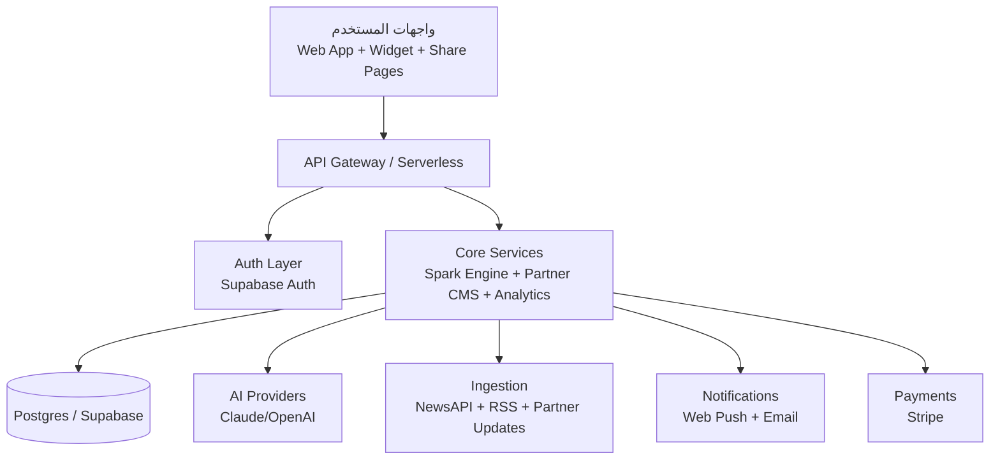

# منصة مَنارة الذكية (Manarah)

منصة عربية حديثة لتحويل محتوى الذكاء الاصطناعي إلى **شرارات تعلم تفاعلية** قابلة للنشر كأداة (Widget) على:
- شبكات التواصل الاجتماعي
- صفحات الويب
- قنوات يوتيوب (رابط ذكي + Landing)
- مجتمعات الشركاء

## الخارطة البصرية (Visual Blueprint)



---

## مراحل التطوير: من Prototype إلى منصة حية

### المرحلة 1 — البنية التحتية (أسبوعان)
**الهدف:** تأمين الاستدعاءات، تفعيل الحسابات، وربط بيانات حقيقية.

1. **API Proxy** عبر `/api/spark` بدل الاستدعاء المباشر من المتصفح.
2. **Supabase Auth** (OTP + Session + user level progress).
3. **Ticker ديناميكي** من NewsAPI/RSS وتخزينه في DB.
4. **تحسين Mobile responsiveness** بدون تغيير بنية HTML.

### المرحلة 2 — التفاعل الحقيقي (4–8 أسابيع)
**الهدف:** خلق قيمة تشغيلية للشركاء والمستخدمين.

5. **Partner Dashboard + CMS** لإدخال التحديثات ونشرها تلقائياً.
6. **Spark Tracking** مع مؤشرات إكمال/زمن/مستوى.
7. **Notifications** (Web Push + Email).
8. **Partner Onboarding مدفوع** عبر Stripe + Webhooks.

### المرحلة 3 — النمو (2–3 أشهر)
**الهدف:** التوسع العضوي وتحسين الاكتساب.

9. **توليد شرارات مجدول** من الأخبار بشكل استباقي.
10. **روابط مشاركة شرارة** مع Open Graph.
11. **SEO عربي** لصفحات الشركاء والمواضيع.

---

## بنية التقنية المقترحة

- **Frontend:** Next.js (App Router) + Tailwind + i18n (ar/en)
- **Backend/API:** Next.js Route Handlers أو Vercel Functions
- **Data/Auth/Realtime:** Supabase (Postgres + Auth + Realtime)
- **AI Orchestration:** Provider-agnostic service layer
- **Queue/Cron:** Vercel Cron + background jobs
- **Billing:** Stripe Checkout + Billing Portal
- **Analytics:** Event pipeline + dashboards

---

## التسليمات داخل هذا المستودع

- مخطط قواعد البيانات الأولية: `database/schema.sql`
- مثال Proxy API آمن: `api/spark.js`
- خارطة تنفيذ تفصيلية: `docs/execution-plan-ar.md`
- قائمة ميزات متقدمة وتحليلات: `docs/advanced-features-ar.md`


---

## كيف تتصفح المنصة الآن؟

للمعاينة الفورية افتح: `web/index.html` بعد تشغيل سيرفر محلي.

```bash
python3 -m http.server 8080
# ثم افتح http://localhost:8080/web/index.html
```

شرح كامل: `docs/how-to-browse-ar.md`.


## رابط مباشر للمنصة
- بعد النشر على Vercel: `https://manarah-yourname.vercel.app`
- توجيه `/` مضبوط لفتح واجهة المنصة مباشرة (`web/index.html`) عبر `vercel.json`.
- تعليمات النشر السريع: `DEPLOY_NOW_AR.md`.
